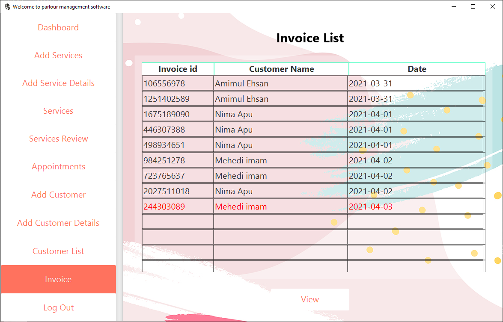

# JavaFx Parlour Management System with Ms sql server

This project is based on ms sql server. This autometically creates all the required table. So, you don't have to worry about anything. This project is created only in 3 days. You are completely free to use the codes.

To make it work it on your machine:
goto: src -> dbOperations -> DbServices -> change connection url

1. Home:
  
  
2. Service Choice:
  
  
3. Date Selection:
  
  
4. Add Appointment:
  
  
5. All Services table with full text search capabilities:
  
  
  
6. Service Details with image and reviews:
  
  
7. About Us:
  
  
8. Admin Signin:
  
  
9. Admin Dashboard:
  
  
10. Add Service image:
  
  
11. Appointments:
  
  
12. Accept appointments:
  
  
13. Add Customer:
  
  
14. Add Custoemr Details:
  
  
15. All Customer List:
  
  
16. Customer All Details:
  
  
17. Invoices List:
  
  
18. Invoice Details:
  
  
19. ERD:
  
  
  
ERD can be found here:

  https://github.com/Amimul1234/Java-Fx-with-ms-sql-server-parlour-management/blob/master/ReadmeImages/erd-diagram-with-data-types.pdf
